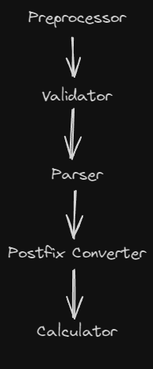

# Calculation Engine

The calculation engine describes the steps taken to convert user input into either:

- A result
- An error report

## Steps

Each of the steps is wrapped in a try/catch statement.  When any of the steps fails an error report
is generated from the expcetion.  It is then printed to the console.  If all the steps succeed the
result is returned to the user.  

Where possible we throw custom exceptions.  These contain as much details as possible, so we can
highlight where & why the expressed failed and, where possible, how to fix.

### Preprocessor

The preprocessor makes minimal, simple, updates to the user input.  It is designed to be fast and
lightweight.  Changes supported:

- Replaces tabs and new lines with a spaces
- Replaces multiple spaces with a single space
- Replaces common operator variants, like `x` & `×`, with the officially supported variant (e.g. `*`)
- Endures the expression ends with a trailing space
  (this final space is used as a end of expression marker in the parser)

As a consequence:

- Parsing is simplified
- Error reports are clearer

The preprocessor assumes most expressions can be clearly printed on a single line.  Which feels
reasonable for a CLI based calculator.

### Infix Validator

Scans the expression for common mistakes:

- Missing expression
- Invalid characters within the expression

The validation does not account for all inaccuracies.  Testing parentheses are properly balanced, for
example, requires parsing.

Like the preprocessor; the validator is design to be fast and simplify later steps.

### Parser

Converts the infix expression into a series of tokens.

### Infix Token Validator

Checks the tokens form a valid sequence.  

### Postfix Converter

Takes a series of infix tokens and converts into a series of postfix tokens.

### Calculator

Convert a series of postfix tokens into a result.
