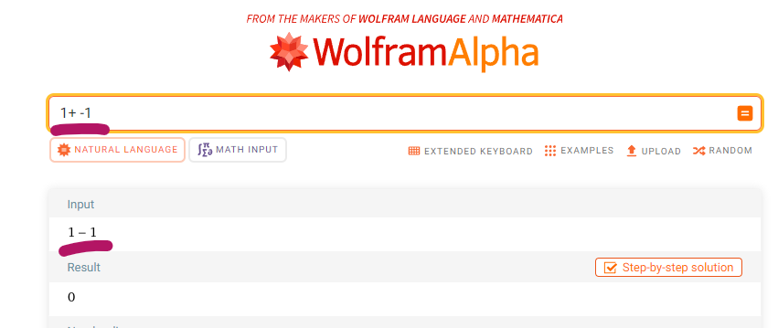

# Negative Numbers

It is common for infix expressions to contain negative numbers.  Example: `1 + -1`.  The same symbol 
is used for the subtraction operator and negation prefix.  The same is true for the additional operator
and the positive prefix.  Example: `1 - +1`.  This can complicates parsing and validation.

As a rule an operator cannot follow another operator.  This should result in a validation failure:
`expected a number not an operator`.  However we need to avoid cases where the operator is acting as 
a prefix.

One approach is to find and replace `+ -` and `- +`.  Wolfram Alpha appears to do this:



The typed input is replaced.  Here both the entered and displayed inputs are equivalent.  But the 
entered input has been simplified.  

The simplification is nice.  It shows the user how their statement can be improved.  Which in a small
way helps to educated people.  But it complicates error reporting.  If we validate the input before
simplification we will need to identify the difference between an operator and a postfix.  To avoid 
cases where the error report does not align with the input:

```powershell
# Does this report confuse the user?
# The output does not match their input?
# Did the app not understand me?
> calc-cli '1 + -1 * not-a-number`
1 - 1 * not-a-number
        ^^^^^^^^^^^^
Expected a number.
```
